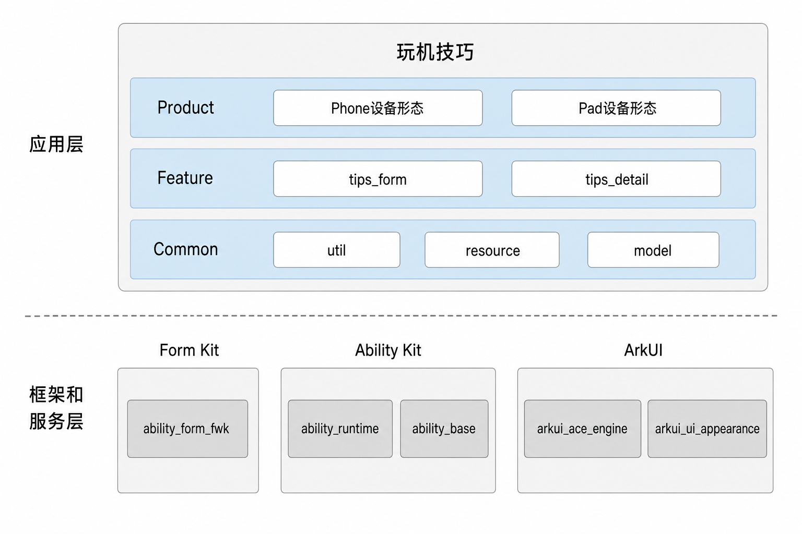

# 玩机技巧（Tips）

## 简介

**玩机技巧**（应用包名：`com.ohos.tips`）是OpenHarmony中预置的**系统应用**，应用通过服务卡片、详情页向用户提供设备使用技巧，并适配手机、平板形态。

### 核心能力

**详情页**
- 支持详情页展示技巧标题、正文与配图，内容区域延伸到状态栏显示，实现沉浸式交互体验。
- 支持响应式布局，根据设备类型与窗口断点自适应布局，手机采用上下布局，平板在宽屏场景下采用左右分栏。
- 支持跟随系统语言切换详情页语言。
- 支持其它系统应用跨应用跳转至详情页。

**服务卡片**
- 支持卡片式内容浏览，提供`2*2`尺寸卡片，展示技巧短文案与背景图。
- 支持点击服务卡片进入对应详情页，展示对应标题、正文与配图。
- 支持每日随机刷新，展示每日技巧。
- 支持按序刷新，从卡片进入详情并退出后，可按卡片列表顺序切换至下一条。
- 支持跟随系统语言切换卡片文案语言。
- 支持新增玩机技巧，在`rawfile`下新增技巧目录并配置详情与卡片资源，需要桌面卡片展示时需要将编号写入`tips_list.json`。

### 架构说明

玩机技巧采用分层与模块化设计，按产品形态、业务特性与公共能力组织代码，如图：

**图1** 玩机技巧分层架构



### 应用层分层设计

整体可划分为产品层、特性层、公共层：

| 层次 | 主要目录/组件 | 说明                                              |
| --- | --- |-------------------------------------------------|
| 产品层 | `product` | 支持手机、平板形态                                       |
| 特性层 | `feature/tips_form`、`feature/tips_detail` | 服务卡片、详情页                                        |
| 公共层 | `common/util`、`common/resource`、`common/model` | util（窗口断点、语言、日志）、resource（rawfile资源读取）、model（跨特性常量与实体） |

依赖方向约束如下：

- 产品层可依赖特性层与公共层。
- 特性层仅可依赖公共层。
- 公共层不依赖产品层或特性层。
- `tips_form`与`tips_detail`之间不互相依赖。

**特性层模块说明**：

| 核心能力 | 模块          | 说明 |
| --- |-------------| --- |
| 详情页 | tips_detail | 沉浸式图文展示、响应式布局、语言切换、跨应用打开 |
| 服务卡片 | tips_ form       | 卡片浏览与跳转、随机/按序刷新、语言切换、技巧扩展 |

**公共层模块说明**：

| 核心能力 | 模块       | 说明 |
| --- |----------| --- |
| 数据模型 | model    | 跨特性常量与内容实体 |
| 资源读取 | resource | rawfile读取与图片转码 |
| 通用工具 | util     | 窗口断点、语言切换、日志与上下文 |

### 与其它应用的关系

| 项目         | 说明                                                                                                                                      |
|------------|-----------------------------------------------------------------------------------------------------------------------------------------|
| 是否允许其它应用调用 | 允许。`EntryAbility`声明`exported`为`true`，其它系统应用可通过显式Want拉起                                                                                  |
| 谁能调用       | 仅系统应用可调用，可通过显式Want启动；桌面可通过服务卡片FormLink拉起                                                                                          |
| 什么时候能调用    | 应用预置或安装后即可调用，打开详情页无需额外运行时权限                                                                                                             |
| 支持的Want参数  | `bundleName`为`com.ohos.tips`，`abilityName`为`EntryAbility`；须通过`parameters.params` JSON字符串携带`detailLink`（取值与`rawfile`子目录名一致），可选携带`formId` |
| 跨进程服务      | 无对外RPC数据服务；跨应用仅支持通过Want打开指定详情页                                                                                                          |

## 编译构建

本工程为多模块 HAP 应用工程，使用 Hvigor 构建，产物为 `com.ohos.tips` 系统应用包。

- 产品层entry模块（`product/phone`）编译为可部署的HAP。
- 特性HAR（`tips_form`、`tips_detail`）与公共HAR（`tips_common`）先编译为HAR，再由产品层依赖打包进HAP。

Ability与Form入口在`product/phone/src/main/module.json5`中声明：

```json
{
  "module": {
    "name": "entry",
    "type": "entry",
    "mainElement": "EntryAbility",
    "deviceTypes": [
      "default",
      "tablet"
    ],
    "abilities": [
      {
        "name": "EntryAbility",
        "srcEntry": "./ets/entryability/EntryAbility.ets",
        "exported": true
      }
    ],
    "extensionAbilities": [
      {
        "name": "EntryFormAbility",
        "srcEntry": "./ets/entryformability/EntryFormAbility.ets",
        "type": "form"
      }
    ]
  }
}
```

### 环境要求
- OpenHarmony SDK（本工程 `compileSdkVersion` 为 23，`compatibleSdkVersion` / `targetSdkVersion` 为 20）
- DevEco Studio 或命令行 Hvigor 工具链
- 系统签名证书（见 `signature/`）

在工程根目录执行：

```bash
# 使用DevEco Studio打开工程后执行Build，或使用hvigor命令行
hvigorw assembleHap
```

构建成功后在`product/phone/build`输出目录生成HAP产物。

## 玩机技巧开发

玩机技巧采用ArkTS语言开发，UI基于ArkUI Stage模型。应用通过`EntryAbility`承载主界面与跨应用跳转，通过`feature/tips_detail`完成详情页展示，通过`feature/tips_form`完成服务卡片编排与刷新，并通过`common`提供窗口、语言、日志与`rawfile`读取等公共能力。开发可参考：[ArkUI开发概述](https://gitcode.com/openharmony/docs/blob/master/zh-cn/application-dev/ui/arkts-ui-development-overview.md)

### 基于已有模块的开发

适用场景：对已有能力做功能定制，例如调整详情页布局与文案展示、修改卡片刷新策略、通过`rawfile`新增技巧内容等。

明确改动点：按业务边界定位到`product/phone`（入口与页面）、`feature/tips_detail`（详情页）、`feature/tips_form`（服务卡片）或`common`（公共能力）。

以下列举一些常见的修改场景：

**场景1：修改详情页链路**
   - 页面UI位于`feature/tips_detail/src/main/ets/default/view/DetailPage.ets`
   - 内容转换位于`feature/tips_detail/src/main/ets/default/convert/DetailPageConvert.ets`
   - 响应式布局位于`feature/tips_detail/src/main/ets/default/util/DetailResponsiveLayoutUtil.ets`

例如，需调整详情页默认编号或语言选择逻辑，可在`DetailPageConvert.idToModel()`中扩展：
```typescript
    // DetailPageConvert.ets
    static idToModel(pageId: string, context: common.Context): DetailPageModel {
      const model: DetailPageModel = new DetailPageModel();
      const resolvedId = pageId || DetailPageConstant.DEFAULT_PAGE_ID;
      const rawFilePath = `${resolvedId}/${DetailPageConstant.DETAIL_JSON}`;
      const entity = RawFileResourceUtil.readJsonSync<DetailPageEntity>(context, rawFilePath);
      // 【修改点】在此扩展默认编号、缺省回退或语言选择逻辑
      ...
      return model;
    }
```

**场景2：修改服务卡片链路**
   - 卡片业务位于`feature/tips_form/src/main/ets/default/presenter/FormPresenter.ets`
   - 内容转换位于`feature/tips_form/src/main/ets/default/convert/TipsConvert.ets`
   - 卡片UI位于`feature/tips_form/src/main/ets/default/view/WidgetCard.ets`

例如，需调整点击跳转参数，可在`WidgetCardView`的FormLink中扩展：
```typescript
    // WidgetCard.ets
    FormLink({
      action: this.actionType,
      abilityName: this.abilityName,
      params: {
        formId: this.formId,
        detailLink: this.detailLink,
      }
    }) {
      // 卡片UI
    }
```

**场景3：修改刷新链路**
   - 按序刷新位于`FormPresenter.updateForm()`（从卡片进入详情后切换下一条）
   - 定时随机刷新位于`FormPresenter.randomRefreshForm()`（由`EntryFormAbility.onUpdateForm`触发）
   - 卡片列表来源于`rawfile/tips_list.json`

例如，需调整按序刷新的下一索引计算，可在`FormPresenter.updateForm()`中修改：
```typescript
    // FormPresenter.ets 
    public updateForm(formId: string): void {
      ...
      let nextIndex = (this.currentIndex + 1) % this.tipsCount;
      // 【修改点】可改为倒序、跳过指定编号或按自定义规则选取 tipId
      let tipId = this.tipIds[nextIndex];
      let nextTip = this.loadTipEntity(tipId, ctx);
      ...
    }
```

**场景4：扩展玩机技巧内容**
   - 资源目录位于`product/phone/src/main/resources/rawfile/`
   - 详情页与服务卡片共用同一技巧编号目录
   - `detail.json`中配置详情页内容，`tip.json`中配置卡片内容，`tips_list.json`决定编号是否进入卡片展示列表
   - 注意：仅添加详情页时，只需`detail.json`与配图，不提供`tip.json`且**不要**写入`tips_list.json`，通过Want携带`detailLink`即可打开；添加卡片时，须在详情资源基础上补充`tip.json`与卡片背景，并将编号写入`tips_list.json`，用户添加桌面服务卡片后方可展示并跳转详情

例如，新增`tip_demo`时，目录与配置示例如下：

```json
    product/phone/src/main/resources/rawfile/
    ├── tips_list.json              # 卡片内容池ID列表
    └── tip_demo/
        ├── detail.json             # 详情页内容（必需）
        ├── tip.json                # 卡片内容（需要桌面卡片时配置）
        ├── tip_demo.png            # 详情配图（必需）
        └── card_bg.jpg             # 卡片背景图（需要桌面卡片时配置）
```

`detail.json` 为详情页资源配置文件，必须提供
```json
    // tip_demo/detail.json 
    {
      "id": "tip_demo",
      "image": "tip_demo.png",
      "title": {
        "zh": "示例技巧标题",
        "en": "Sample tip title"
      },
      "content": {
        "zh": "这里是详情页中文正文。",
        "en": "Detail page body in English."
      }
    }
```
`tip.json` 为卡片资源配置文件，仅添加详情页时不提供，添加卡片时必须提供
```json
    // tip_demo/tip.json
    {
      "tipBgImage": "card_bg.jpg",
      "tipDesc": {
        "zh": "示例卡片短文案",
        "en": "Sample card description"
      },
      "detailLink": "tip_demo"
    }
```
`tips_list.json` 用于配置需要展示的卡片列表，仅添加详情页时不要写入编号，添加卡片时必须追加编号
```json
    // tips_list.json — 仅添加详情页时不要写入；添加卡片时必须追加编号
    ["tip_openharmony", "tip_calendar", "tip_play_tips", "tip_demo"]
```
**场景5：修改UI组件**
   - 详情页UI位于`feature/tips_detail/src/main/ets/default/view/DetailPage.ets`
   - 卡片UI位于`feature/tips_form/src/main/ets/default/view/WidgetCard.ets`
   - 详情响应式布局位于`feature/tips_detail/src/main/ets/default/util/DetailResponsiveLayoutUtil.ets`

例如，需调整卡片标题样式，可在`widgetInfoBuilder()`中修改：
```typescript
    // WidgetCard.ets 
    Text(this.widgetTitle)
      .fontSize($r('sys.float.ohos_id_text_size_headline9'))
      .fontWeight(FontWeight.Bold)
      .maxLines(1)
      .textOverflow({ overflow: TextOverflow.Ellipsis })
      .fontColor($r('sys.color.ohos_fa_text_primary_dark'))
      .layoutWeight(1)
```

常用修改入口：

| 目标 | 路径 |
| --- | --- |
| 详情页UI | `feature/tips_detail/src/main/ets/default/view/DetailPage.ets` |
| 详情内容转换 | `feature/tips_detail/src/main/ets/default/convert/DetailPageConvert.ets` |
| 响应式布局 | `feature/tips_detail/src/main/ets/default/util/DetailResponsiveLayoutUtil.ets` |
| 卡片业务 | `feature/tips_form/src/main/ets/default/presenter/FormPresenter.ets` |
| 卡片内容转换 | `feature/tips_form/src/main/ets/default/convert/TipsConvert.ets` |
| 卡片UI | `feature/tips_form/src/main/ets/default/view/WidgetCard.ets` |
| 首页路由 | `product/phone/src/main/ets/pages/Index.ets` |
| 卡片Form | `product/phone/src/main/ets/widget/pages/WidgetCard.ets` |
| 技巧内容资源 | `product/phone/src/main/resources/rawfile/` |

### 新特性能力的开发

适用场景：新增详情或卡片相关能力、扩展卡片尺寸与刷新策略、补充差异化交互，或适配新设备形态。

> **说明：**
> 当前工程采用`product + feature + common`多模块结构，产品入口主要在`product/phone`。新能力一般按现有分层扩展；若新增产品形态HAP，可在`product/`下增加对应目录并在`build-profile.json5`中注册。

**步骤1：扩展业务能力**

1. 在`feature/tips_detail`中补充详情页UI、转换或响应式布局逻辑。
2. 在`feature/tips_form`中补充卡片编排、转换或`WidgetCardView`展示逻辑。
3. 如涉及公共能力，在`common`中扩展常量、`rawfile`读取或窗口/语言工具，并由特性层引用。
4. 如涉及产品入口，在`product/phone`的`EntryAbility`、`EntryFormAbility`、`pages/`或`widget/pages/`中同步扩展。
5. 如仅扩展技巧内容，按上一节「扩展技巧内容」在`rawfile`新增目录，并按需更新`tips_list.json`。

**步骤2：配置/确认Ability入口**

本工程入口已在`product/phone/src/main/module.json5`中声明，扩展能力时通常只需确认Ability、Form与`exported`配置是否满足新场景：

```json
{
  "module": {
    "name": "entry",
    "type": "entry",
    "mainElement": "EntryAbility",
    "deviceTypes": [
      "default",
      "tablet"
    ],
    "abilities": [
      {
        "name": "EntryAbility",
        "srcEntry": "./ets/entryability/EntryAbility.ets",
        "exported": true
      }
    ],
    "extensionAbilities": [
      {
        "name": "EntryFormAbility",
        "srcEntry": "./ets/entryformability/EntryFormAbility.ets",
        "type": "form"
      }
    ]
  }
}
```

**步骤3：定制UI**

在完成业务能力与Ability配置后，按上一节对「已有模块的功能修改与裁剪」中的详情页、服务卡片或产品入口修改方式扩展即可。

若需新增独立页面：

1. 在对应模块新增页面或`@Builder`入口文件；
2. 如需系统路由注册，在`resources/base/profile/router_map.json`中声明，并由产品层`pages/`提供Builder；
3. 由`Index`的`Navigation`、`pushPathByName`或Want路由拉起。

若需扩展服务卡片：

1. 在`feature/tips_form`扩展卡片UI与`FormPresenter`刷新逻辑；
2. 在`product/phone`的`widget/pages/`保留Form入口，并同步更新`form_config.json`中的尺寸或刷新配置；
3. 在桌面服务卡片入口添加卡片后验证展示与点击跳转。

## 目录

```text
openharmonytips
├─AppScope                                      # 应用级配置与多语言资源
│  ├─app.json5                                  # bundleName、版本号等
│  └─resources/                                 # 全局字符串 / 图标等资源
├─common                                        # 公共能力层
│  └─src/main/ets/default/
│     ├─model/                                  # 公共数据模型，包括详情页常量、内容实体等
│     ├─resource/                               # rawfile资源读取，包括json资源读取与图片转码等
│     └─util/                                   # 通用工具，包括窗口断点、语言切换、日志与上下文等
├─feature                                       # 特性层
│  ├─tips_form/                                 # 服务卡片特性
│  │  └─src/main/ets/default/
│  │     ├─convert/                             # 卡片内容转换，包括json解析与模型转换等
│  │     ├─entity/                              # 卡片实体，包括技巧短文案与背景等数据
│  │     ├─model/                               # 卡片模型，包括技巧数据、卡片参数、跳转参数等数据实体
│  │     ├─presenter/                           # 卡片业务逻辑，包括添加刷新、随机/按序切换等
│  │     └─view/                                # 卡片UI
│  └─tips_detail/                               # 详情页特性
│     └─src/main/ets/default/
│        ├─common/                              # 详情页工具，包括环境属性等
│        ├─convert/                             # 详情内容转换，包括详情数据解析与模型转换等
│        ├─entity/                              # 详情实体，包括标题、正文与配图等数据
│        ├─model/                               # 详情模型，包括标题、正文与配图等展示数据
│        ├─util/                                # 响应式布局，包括手机上下布局、平板左右分栏等
│        └─view/                                # 详情页UI，包括沉浸式图文展示等
├─product                                       # 产品层
│  └─phone/                                     # 手机 / 平板形态 HAP
│     └─src/main/
│        ├─ets/
│        │  ├─entryability/                     # 应用主入口
│        │  ├─entryformability/                 # 服务卡片生命周期管理
│        │  ├─pages/                            # 页面入口
│        │  └─widget/pages/                     # 卡片组件入口
│        ├─resources/
│        │  ├─base/profile/                     # 配置文件
│        │  └─rawfile/                          # 技巧资源
│        └─module.json5                         # Ability与Form声明
├─hvigor                                        # 构建工具配置
├─signature                                     # 签名证书与profile
├─build-profile.json5                           # 工程级SDK / 签名 / product配置
├─oh-package.json5
├─OAT.xml                                       # 开源合规审计
├─LICENSE
├─README.md                                     # 英文说明文档
└─README-zh.md                                  # 中文说明文档
```

## 约束

- **语言版本**：ArkTS
- **运行形态**：系统预置应用（`com.ohos.tips`）
- **设备类型**：手机、平板
- **服务卡片尺寸**：仅支持`2*2`
- **跨应用跳转**：仅系统应用可进行跨应用跳转；`EntryAbility`须保持`exported`为`true`；Want须通过`parameters.params` JSON字符串携带`detailLink`（取值与`rawfile`子目录名一致）
- **形态适配**：手机默认上下布局，平板在宽屏场景（横向断点大于或等于`840vp`）下为左右分栏；修改UI时需覆盖手机与平板验证

## 参考文献

欢迎广大开发者贡献代码、文档等，具体的贡献流程和方式请参见[参与贡献](https://gitcode.com/openharmony/docs/blob/master/zh-cn/contribute/%E5%8F%82%E4%B8%8E%E8%B4%A1%E7%8C%AE.md)。

## 相关仓

[**applications_settings**](https://gitcode.com/openharmony/applications_settings)

[**window_scene_board**](https://gitcode.com/openharmony/window_scene_board)
