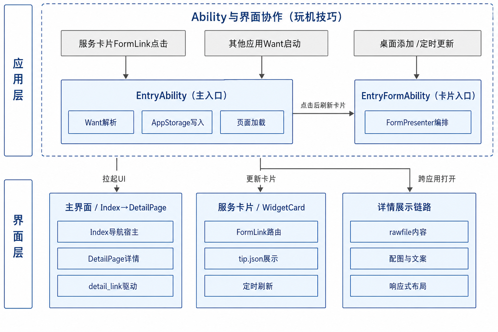
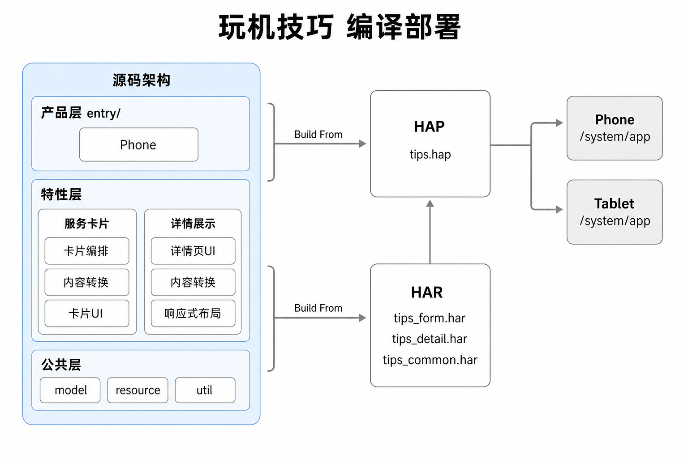

# 玩机技巧

## 简介

### 内容介绍

玩机技巧（应用包名：`com.ohos.tips`）是OpenHarmony标准系统预置应用。在系统应用层面向用户提供设备使用技巧的浏览与展示能力，通过详情页沉浸式展示图文内容，并支持系统语言切换与跨应用跳转。

#### 核心功能

- 服务卡片：支持尺寸为`2*2`；展示技巧短文案与背景图；点击后打开对应详情页。
- 详情页：以图文展示技巧标题、正文与配图；内容可延伸至状态栏区域。
- 卡片刷新：卡片支持按日随机刷新；从卡片进入详情并退出后，卡片可按列表顺序切换下一条。
- 响应式布局：详情页根据设备类型与窗口断点自适应布局；手机采用上下布局，平板在宽屏场景下采用左右分栏。
- 多语言：可跟随系统语言切换卡片及详情页语言。
- 跨应用跳转：其它应用可通过显式Want启动`EntryAbility`，在参数中传入`detailLink`打开指定技巧详情。

> **说明：**
> 桌面是否显示玩机技巧服务卡片，由用户在桌面服务卡片入口中主动添加决定。`tips_list.json`仅决定进入该卡片刷新列表的技巧编号，不会向桌面强制添加卡片。

#### 使用场景

**表1** 使用场景

| 场景 | 说明                                             |
| --- |------------------------------------------------|
| 桌面浏览技巧摘要 | 用户添加`2*2`服务卡片后，在桌面查看技巧短文案与背景图。                 |
| 查看技巧详情 | 用户点击服务卡片，进入详情页阅读标题、正文与配图。                      |
| 定时轮换技巧 | 服务卡片按`updateDuration`配置定时刷新，从内容池中随机展示技巧。       |
| 顺序切换技巧 | 用户从服务卡片进入详情并退出后，卡片切换至列表中的下一条技巧。                |
| 跨应用打开指定技巧 | 其它应用通过Want传入`detailLink`，直接打开对应详情页。            |
| 扩展技巧资源 | 开发者在`rawfile`下新增技巧目录，并按需将编号写入`tips_list.json`。 |

#### 支持的设备

**表2** 支持的设备与运行条件

| 项目 | 说明                                                                      |
| --- |-------------------------------------------------------------------------|
| 产品入口 | 仅构建`product/phone`；模块名为`entry`；应用包名为`com.ohos.tips`。                    |
| 设备类型声明 | `product/phone/src/main/module.json5`中`deviceTypes`为`default`、`tablet`。 |
| 手机 | 详情页默认上下布局；服务卡片尺寸为`2*2`。                                                 |
| 平板 | 横向断点大于或等于`840vp`时详情页为左右分栏；无独立`product/pad`模块。                |
| 运行环境 | OpenHarmony标准系统，以系统预置应用方式部署。                                            |
| 服务卡片尺寸 | 仅支持`2*2`。                      |

### 架构说明

玩机技巧工程按可复用程度划分为产品层（product）、特性层（feature）、公共层（common）。可部署产物为1个entry类型HAP（`com.ohos.tips`）。特性与公共能力以HAR模块提供，由产品层组装。当前仅提供`product/phone`产品入口。

**图1** 玩机技巧分层架构


**表3** 分层职责

| 层级 | 路径 | 职责 |
| --- | --- | --- |
| 产品层 | `product/phone` | 承载Ability生命周期、Want解析、服务卡片接入；声明`module.json5`、`form_config.json`、`router_map.json`；提供页面与Form；存放技巧内容`rawfile`；组装特性层与公共层并输出HAP。 |
| 特性层 | `feature/tips_form`、`feature/tips_detail` | `tips_form`提供卡片编排、转换、模型与卡片UI；`tips_detail`提供详情页UI、转换、模型与响应式布局。 |
| 公共层 | `common` | `util`提供窗口、语言、日志等工具；`resource`提供`RawFileResourceUtil`；`model`提供跨特性共享常量与实体。 |

依赖方向约束如下：

- 产品层可依赖特性层与公共层。
- 特性层仅可依赖公共层。
- 公共层不依赖产品层或特性层。
- `tips_form`与`tips_detail`之间不互相依赖。

玩机技巧与桌面、其它应用的协作关系如下：

1. 用户添加服务卡片后，`EntryFormAbility`处理添加、更新与刷新；`FormPresenter`读取`rawfile`并更新卡片。
2. 用户点击服务卡片时，通过FormLink启动`EntryAbility`，携带`detailLink`打开对应详情页。
3. 其它应用可通过显式Want启动`EntryAbility`，传入`detailLink`打开指定详情页。

**图2** Ability与界面协作关系



**表4** 主数据流

| 流程 | 入口 | 处理链路 | 结果 |
| --- | --- | --- | --- |
| 打开详情 | Want或FormLink携带`detailLink` | `EntryAbility` → AppStorage（`detail_link`） → 详情页 | 加载`rawfile/{id}/detail.json`与配图并展示 |
| 添加或刷新卡片 | 桌面添加或定时更新 | `EntryFormAbility` → `FormPresenter` | 读取`tips_list.json`与`rawfile/{id}/tip.json`，刷新服务卡片 |

**表5** 产品层模块

| 模块 | 路径 | 说明 |
| -- | --- | --- |
| 主入口 | `product/phone/src/main/ets/entryability/` | `EntryAbility`：Want解析、详情跳转、页面加载 |
| 服务卡片入口 | `product/phone/src/main/ets/entryformability/` | `EntryFormAbility`：卡片添加、更新、移除、语言刷新 |
| 页面 | `product/phone/src/main/ets/pages/` | `Index`；`DetailPage`（`router_map`入口，UI位于`feature/tips_detail`） |
| Form | `product/phone/src/main/ets/widget/pages/` | `WidgetCard`（`form_config`入口，UI位于`feature/tips_form`） |
| 配置与资源 | `AppScope/`、`module.json5`、`rawfile` | 应用包名、Ability导出、Form配置、技巧内容资源 |

**表6** 特性层模块

| 模块 | 路径 | 说明 |
| --- | --- | --- |
| 服务卡片特性 | `feature/tips_form`（`@ohos/tips_form`） | `FormPresenter`、`TipsConvert`、卡片模型与实体、`WidgetCardView` |
| 详情特性 | `feature/tips_detail`（`@ohos/tips_detail`） | `DetailPage`、`DetailPageConvert`、响应式布局、`EnvironmentProp` |

**表7** 公共层模块

| 模块 | 路径 | 说明 |
| --- | --- | --- |
| model | `common/src/main/ets/default/model/` | `DetailPageConstant`、`DetailPageContentEntity` |
| resource | `common/src/main/ets/default/resource/` | `RawFileResourceUtil` |
| util | `common/src/main/ets/default/util/` | 窗口断点、语言、日志、`ContextHelper`、`StringUtil` |

**表8** 模块依赖关系

| 依赖方 | 被依赖方 |
| --- | --- |
| `product/phone`（entry HAP） | `@ohos/tips_form`、`@ohos/tips_detail`、`@ohos/common` |
| `feature/tips_form` | `@ohos/common` |
| `feature/tips_detail` | `@ohos/common` |
| `common` | _ |

## 目录

```text
openharmonytips
├── AppScope                                    # 应用级配置与多语言资源
├── common                                      # 公共层HAR（@ohos/common，模块名tips_common）
│   └── src/main/ets/default
│       ├── model                               # 跨特性常量与实体
│       ├── resource                            # RawFileResourceUtil
│       └── util                                # 窗口、语言、日志等工具
├── feature
│   ├── tips_form                               # 服务卡片特性HAR（@ohos/tips_form）
│   └── tips_detail                             # 详情特性HAR（@ohos/tips_detail）
├── product
│   └── phone                                   # 产品层唯一entry HAP
│       └── src/main
│           ├── ets
│           │   ├── entryability                # EntryAbility
│           │   ├── entryformability            # EntryFormAbility
│           │   ├── pages                       # 页面组件
│           │   └── widget/pages                # 卡片组件
│           ├── resources
│           │   ├── base/profile                # form_config、main_pages、router_map
│           │   └── rawfile                     # 技巧资源
│           └── module.json5                    # Ability与Form声明
├── hvigor                                      # 构建工具配置
├── signature                                   # 签名
├── oh-package.json5
├── README-zh.md
└── README.md
```

## 约束

**表9** 运行与开发约束

| 约束项 | 说明                                                                                   |
| --- |--------------------------------------------------------------------------------------|
| 开发语言 | ArkTS；UI基于ArkUI Stage模型。                                                             |
| 运行形态 | 系统预置应用（`com.ohos.tips`）。                                                             |
| 设备类型 | `deviceTypes`为`default`、`tablet`；无独立`product/pad`模块。                                 |
| 服务卡片尺寸 | 仅支持`2*2`。                                                                            |
| 跨应用跳转 | `EntryAbility`须保持`exported`为`true`；Want须通过`parameters.params` JSON字符串携带`detailLink`。 |

## 编译构建

**图3** 玩机技巧编译部署



### 确认构建产物组成

目的：明确本工程由1个entry HAP与3个HAR组装而成，避免按单模块路径查找源码。

- 产品层entry模块（`product/phone`）编译为可部署的HAP。
- 特性HAR（`tips_form`、`tips_detail`）与公共HAR（`tips_common`）先编译为HAR，再由产品层依赖打包进HAP。
- 模块依赖关系见**表8**。

Ability与Form入口在`product/phone/src/main/module.json5`中声明（节选）：

```json
{
  "module": {
    "name": "entry",
    "type": "entry",
    "mainElement": "EntryAbility",
    "deviceTypes": [
      "default",
      "tablet"
    ],
    "abilities": [
      {
        "name": "EntryAbility",
        "srcEntry": "./ets/entryability/EntryAbility.ets",
        "exported": true
      }
    ],
    "extensionAbilities": [
      {
        "name": "EntryFormAbility",
        "srcEntry": "./ets/entryformability/EntryFormAbility.ets",
        "type": "form"
      }
    ]
  }
}
```
### 执行HAP编译

目的：在本地生成可安装的HAP，用于联调或合入系统镜像前的验证。

> **须知：**
> 请使用与工程`build-profile.json5`匹配的DevEco Studio及OpenHarmony SDK。

在工程根目录执行：

```bash
# 使用DevEco Studio打开工程后执行Build，或使用hvigor命令行
hvigorw assembleHap
```
正确标准：构建成功，并在`product/phone/build`输出目录生成HAP产物。

若作为OpenHarmony系统部件合入源码树，按平台统一构建方式将本应用作为预置系统应用打包进镜像，部署路径为设备`/system/app`。

## 使用方法

### 调整已有业务模块

目的：在分层架构下定位并修改卡片或详情相关代码。

常用修改入口如下。

**表10** 常用修改入口

| 目标     | 路径 |
|--------| --- |
| 详情页UI  | `feature/tips_detail/src/main/ets/default/view/DetailPage.ets` |
| 详情内容转换 | `feature/tips_detail/src/main/ets/default/convert/DetailPageConvert.ets` |
| 响应式布局  | `feature/tips_detail/src/main/ets/default/util/DetailResponsiveLayoutUtil.ets` |
| 卡片业务   | `feature/tips_form/src/main/ets/default/presenter/FormPresenter.ets` |
| 卡片内容转换 | `feature/tips_form/src/main/ets/default/convert/TipsConvert.ets` |
| 卡片UI   | `feature/tips_form/src/main/ets/default/view/WidgetCard.ets` |
| 首页路由   | `product/phone/src/main/ets/pages/Index.ets` |
| 卡片组件   | `product/phone/src/main/ets/widget/pages/WidgetCard.ets` |

正确标准：修改后重新编译安装，目标界面或卡片行为符合预期。

### 新增一条玩机技巧

目的：在不改UI代码的前提下，通过`rawfile`扩展技巧内容。

资源目录约定：

```text
product/phone/src/main/resources/rawfile/
├── tips_list.json              # 卡片内容池ID列表
├── tip_openharmony/
│   ├── detail.json             # 详情页内容（必需）
│   ├── tip.json                # 卡片内容（需要桌面卡片时配置）
│   ├── tip_openharmony.png     # 详情配图（必需）
│   └── card_bg.jpg             # 卡片背景图（需要桌面卡片时配置）
└── tip_calendar/
    └── ...
```
**表11** 技巧资源字段

| 文件 | 关键字段 | 说明                                   |
| --- | --- |--------------------------------------|
| detail.json | `id`、`image`、`title`、`content` | `id`与目录名一致；`title`与`content`为`{zh,en}` |
| tip.json | `tipBgImage`、`tipDesc`、`detailLink` | 仅卡片场景需要；`detailLink`指向详情编号           |
| tips_list.json | string数组 | 仅列入的ID参与桌面卡片展示                       |

步骤：

1. 在`rawfile`下新建`{编号}/`目录（例如`tip_demo`），用于存放该技巧全部资源。
2. 至少放入`detail.json`及详情配图，用于详情页与跨应用跳转展示。
3. 若仅需详情页或跨应用跳转、不展示桌面卡片：不要将编号写入`tips_list.json`，可不提供`tip.json`。
4. 若需要桌面卡片展示：补充`tip.json`与卡片背景图，并在`tips_list.json`末尾追加编号。

详情与卡片完整示例如下：

```json
// tip_demo/detail.json
{
  "id": "tip_demo",
  "image": "tip_demo.png",
  "title": {
    "zh": "示例技巧标题",
    "en": "Sample tip title"
  },
  "content": {
    "zh": "这里是详情页中文正文。",
    "en": "Detail page body in English."
  }
}
```
```json
// tip_demo/tip.json
{
  "tipBgImage": "card_bg.jpg",
  "tipDesc": {
    "zh": "示例卡片短文案",
    "en": "Sample card description"
  },
  "detailLink": "tip_demo"
}
```
```json
// tips_list.json（追加tip_demo）
["tip_openharmony", "tip_calendar", "tip_play_tips", "tip_demo"]
```
正确标准：

- 仅详情：通过Want传入对应`detailLink`可打开详情页。
- 含卡片：用户添加服务卡片后，新编号出现在待展示的卡片列表中，点击可进入对应详情。

**表12** 是否展示服务卡片

| 诉求         | detail.json与配图 | tip.json与卡片背景 | 是否写入tips_list.json |
|------------| --- | --- | --- |
| 仅详情或仅跨应用跳转 | 需要 | 不需要 | 否 |
| 详情与桌面卡片展示  | 需要 | 需要 | 是 |

## 说明

### 接口说明

本节仅列出跨应用打开玩机技巧详情页时需使用的Want参数，便于其它应用对接。

**表13** 跨应用跳转Want参数

| 配置项 | 取值 | 说明 |
| --- | --- | --- |
| `bundleName` | `com.ohos.tips` | 玩机技巧应用包名 |
| `abilityName` | `EntryAbility` | 主Ability名称 |
| `parameters.params` | JSON字符串 | 须包含`detailLink`，取值与`rawfile`子目录名一致 |

调用示例（ArkTS）：

```typescript
import { common, Want } from '@kit.AbilityKit';
import { BusinessError } from '@kit.BasicServicesKit';

private launchTipsDetail(detailLink: string): void {
  const context = this.getUIContext().getHostContext() as common.UIAbilityContext;
  const want: Want = {
    bundleName: 'com.ohos.tips',
    abilityName: 'EntryAbility',
    parameters: {
      // 必须是JSON字符串；detailLink对应rawfile子目录名
      params: JSON.stringify({ detailLink: detailLink })
    }
  };
  context.startAbility(want).catch((err: BusinessError) => {
    console.error(`startAbility failed, code: ${err.code}, message: ${err.message}`);
  });
}

// 例如跳转到test详情页（工程内已有rawfile/test/detail.json）
this.launchTipsDetail('test');
```
Want参数结构示意：

```json
{
  "bundleName": "com.ohos.tips",
  "abilityName": "EntryAbility",
  "parameters": {
    "params": "{\"detailLink\":\"test\"}"
  }
}
```
### 使用说明

#### 浏览桌面服务卡片

目的：在桌面查看技巧摘要。

1. 在设备桌面的服务卡片入口中添加玩机技巧卡片（尺寸`2*2`）。
2. 查看卡片展示的短文案与背景图。

正确标准：卡片正常显示，并可点击进入详情。

#### 查看技巧详情

目的：阅读完整图文说明。

1. 点击桌面服务卡片，或由其他应用通过Want传入`detailLink`启动`EntryAbility`。
2. 在详情页阅读标题、正文与配图。

正确标准：展示内容与`rawfile/{detailLink}/detail.json`及配图一致；宽屏断点下可为左右分栏。

#### 卡片跳转FormLink说明

目的：理解卡片点击如何拉起详情页。

卡片UI实现位于`feature/tips_form`的`WidgetCardView`，通过FormLink携带`detailLink`与`formId`：

```typescript
// feature/tips_form/src/main/ets/default/view/WidgetCard.ets
FormLink({
  action: this.actionType,
  abilityName: this.abilityName,
  params: {
    formId: this.formId,
    detailLink: this.detailLink,
  }
}) {
  // 卡片UI
}
```
## 参考文献

欢迎广大开发者贡献代码、文档等，具体的贡献流程和方式请参见[参与贡献](https://gitcode.com/openharmony/docs/blob/master/zh-cn/contribute/%E5%8F%82%E4%B8%8E%E8%B4%A1%E7%8C%AE.md)。

## 相关仓

[**ability_form_fwk**](https://gitcode.com/openharmony/ability_form_fwk)

[**arkui_ace_engine**](https://gitcode.com/openharmony/arkui_ace_engine)

[**arkui_ui_appearance**](https://gitcode.com/openharmony/arkui_ui_appearance)

[**ability_base**](https://gitcode.com/openharmony/ability_ability_base)

[**ability_runtime**](https://gitcode.com/openharmony/ability_ability_runtime)
