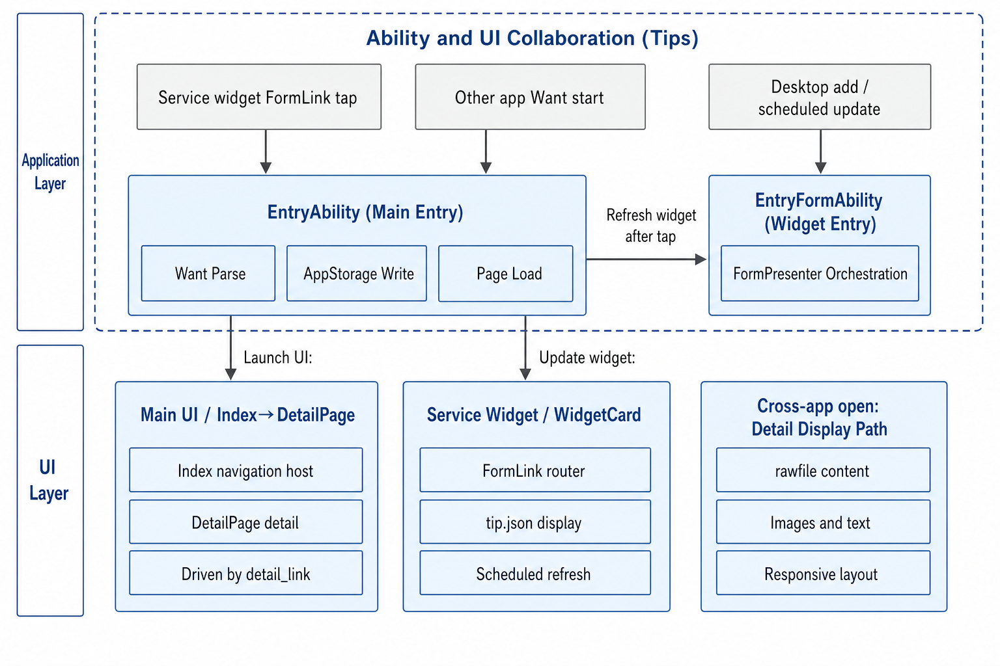
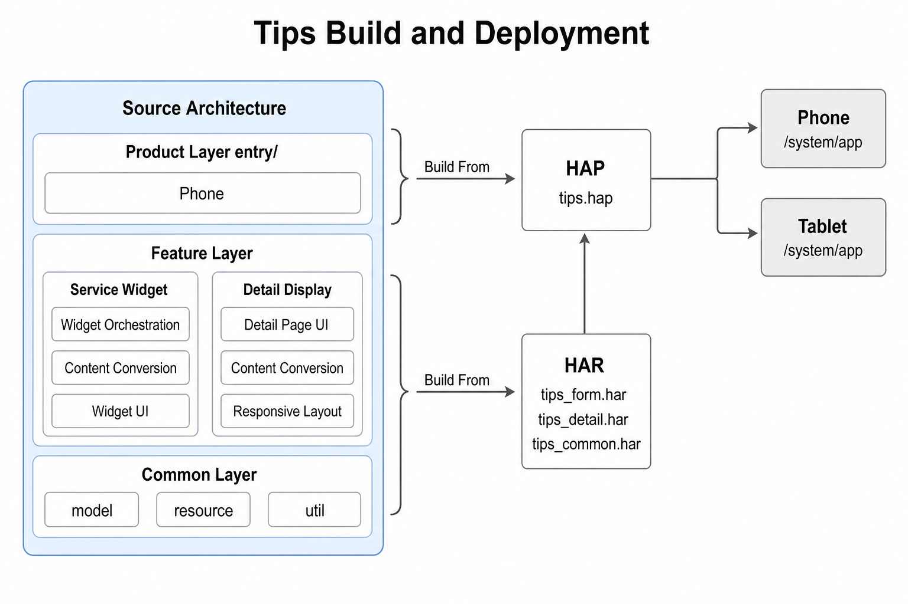

# Tips

## Introduction

### Content Overview

Tips (bundle name: `com.ohos.tips`) is a preinstalled system application on the OpenHarmony standard system. At the system application layer, it provides browsing and display of device usage tips for end users. It presents image-and-text content immersively on the detail page, and supports system language switching and cross-application navigation.

#### Core Features

- Service widget: size `2*2`; displays short tip text and a background image; opens the matching detail page on tap.
- Detail page: presents tip title, body, and image; content can extend into the status bar area.
- Widget refresh: supports random daily rotation; after opening detail from the widget and exiting, the widget can switch to the next tip in list order.
- Responsive layout: the detail page adapts by device type and window breakpoint; phones use a top-bottom layout; tablets use a left-right split in wide-screen scenarios.
- Locales: card and detail page languages can follow the system language.
- Cross-application navigation: other applications can start `EntryAbility` with an explicit Want and pass `detailLink` in parameters to open a specified tip detail.

> **Note:**
> Whether the Tips service widget appears on the desktop depends on the user adding it from the desktop service-widget entry. `tips_list.json` only decides which tip IDs enter the widget refresh list. It does not force a widget onto the desktop.

#### Usage Scenarios

**Table 1** Usage scenarios

| Scenario | Description |
| --- | --- |
| Browse tip summaries on the desktop | After adding the `2*2` service widget, the user views short tip text and a background image on the desktop. |
| View tip details | The user taps the service widget and opens the detail page to read the title, body, and image. |
| Rotate tips on a schedule | The service widget refreshes per `updateDuration` and randomly displays a tip from the content pool. |
| Switch tips in sequence | After the user opens detail from the service widget and exits, the widget switches to the next tip in the list. |
| Open a specified tip across applications | Another application passes `detailLink` through Want and opens the matching detail page. |
| Extend tip resources | Developers add a tip directory under `rawfile` and, as needed, append its ID to `tips_list.json`. |

#### Supported Devices

**Table 2** Supported devices and runtime conditions

| Item | Description |
| --- | --- |
| Product entry | Builds only `product/phone`; module name is `entry`; bundle name is `com.ohos.tips`. |
| Declared device types | In `product/phone/src/main/module.json5`, `deviceTypes` are `default` and `tablet`. |
| Phone | Detail page defaults to a top-bottom layout; service widget size is `2*2`. |
| Tablet | When the horizontal breakpoint is greater than or equal to `840vp`, the detail page uses a left-right split; no separate `product/pad` module. |
| Runtime | OpenHarmony standard system; deployed as a preinstalled system application. |
| Service widget size | Only `2*2` is supported. |

### Architecture Description

The Tips project is divided into product, feature, and common layers by reusability. The deployable artifact is one entry-type HAP (`com.ohos.tips`). Feature and common capabilities are provided as HAR modules and assembled by the product layer. Currently only the `product/phone` product entry is provided.

**Figure 1** Tips layered architecture


**Table 3** Layer responsibilities

| Layer | Path | Responsibility |
| --- | --- | --- |
| Product | `product/phone` | Hosts Ability lifecycle, Want parsing, and service-widget integration; declares `module.json5`, `form_config.json`, and `router_map.json`; provides pages and Form; stores tip content in `rawfile`; assembles feature and common layers into the HAP. |
| Feature | `feature/tips_form`, `feature/tips_detail` | `tips_form` provides widget orchestration, conversion, models, and widget UI; `tips_detail` provides detail-page UI, conversion, models, and responsive layout. |
| Common | `common` | `util` provides window, language, and logging utilities; `resource` provides `RawFileResourceUtil`; `model` provides cross-feature shared constants and entities. |

Dependency rules:

- The product layer may depend on the feature and common layers.
- The feature layer may depend only on the common layer.
- The common layer does not depend on the product or feature layers.
- `tips_form` and `tips_detail` do not depend on each other.

Collaboration among Tips, the desktop, and other applications is as follows:

1. After the user adds the service widget, `EntryFormAbility` handles add, update, and refresh; `FormPresenter` reads `rawfile` and updates the widget.
2. When the user taps the service widget, FormLink starts `EntryAbility` with `detailLink` and opens the matching detail page.
3. Other applications can start `EntryAbility` with an explicit Want and pass `detailLink` to open a specified detail page.

**Figure 2** Ability and UI collaboration



**Table 4** Primary data flows

| Flow | Entry | Processing chain | Result |
| --- | --- | --- | --- |
| Open detail | Want or FormLink with `detailLink` | `EntryAbility` → AppStorage (`detail_link`) → detail page | Loads `rawfile/{id}/detail.json` and images for display |
| Add or refresh widget | Desktop add or scheduled update | `EntryFormAbility` → `FormPresenter` | Reads `tips_list.json` and `rawfile/{id}/tip.json`, then refreshes the service widget |

**Table 5** Product-layer modules

| Module | Path | Description |
| --- | --- | --- |
| Main entry | `product/phone/src/main/ets/entryability/` | `EntryAbility`: Want parsing, detail navigation, page loading |
| Service-widget entry | `product/phone/src/main/ets/entryformability/` | `EntryFormAbility`: widget add, update, remove, and language refresh |
| Page | `product/phone/src/main/ets/pages/` | `Index`; `DetailPage` (`router_map` entry; UI in `feature/tips_detail`) |
| Form | `product/phone/src/main/ets/widget/pages/` | `WidgetCard` (`form_config` entry; UI in `feature/tips_form`) |
| Configuration and resources | `AppScope/`, `module.json5`, `rawfile` | Bundle name, Ability export, Form configuration, tip content resources |

**Table 6** Feature-layer modules

| Module | Path | Description |
| --- | --- | --- |
| Service-widget feature | `feature/tips_form` (`@ohos/tips_form`) | `FormPresenter`, `TipsConvert`, widget models and entities, `WidgetCardView` |
| Detail feature | `feature/tips_detail` (`@ohos/tips_detail`) | `DetailPage`, `DetailPageConvert`, responsive layout, `EnvironmentProp` |

**Table 7** Common-layer modules

| Module | Path | Description |
| --- | --- | --- |
| model | `common/src/main/ets/default/model/` | `DetailPageConstant`, `DetailPageContentEntity` |
| resource | `common/src/main/ets/default/resource/` | `RawFileResourceUtil` |
| util | `common/src/main/ets/default/util/` | Window breakpoints, language, logging, `ContextHelper`, `StringUtil` |

**Table 8** Module dependencies

| Dependent | Dependency |
| --- | --- |
| `product/phone` (entry HAP) | `@ohos/tips_form`, `@ohos/tips_detail`, `@ohos/common` |
| `feature/tips_form` | `@ohos/common` |
| `feature/tips_detail` | `@ohos/common` |
| `common` | _ |

## Directory

```text
openharmonytips
├── AppScope                                    # App-level config and locale resources
├── common                                      # Common HAR (@ohos/common, module tips_common)
│   └── src/main/ets/default
│       ├── model                               # Cross-feature constants and entities
│       ├── resource                            # RawFileResourceUtil
│       └── util                                # Window, language, logging utilities
├── feature
│   ├── tips_form                               # Service-widget feature HAR (@ohos/tips_form)
│   └── tips_detail                             # Detail feature HAR (@ohos/tips_detail)
├── product
│   └── phone                                   # Sole product entry HAP
│       └── src/main
│           ├── ets
│           │   ├── entryability                # EntryAbility
│           │   ├── entryformability            # EntryFormAbility
│           │   ├── pages                       # Page components
│           │   └── widget/pages                # Widget components
│           ├── resources
│           │   ├── base/profile                # form_config, main_pages, router_map
│           │   └── rawfile                     # Tip resources
│           └── module.json5                    # Ability and Form declarations
├── hvigor                                      # Build tool config
├── signature                                   # Signing
├── oh-package.json5
├── README-zh.md
└── README.md
```

## Constraints

**Table 9** Runtime and development constraints

| Constraint | Description |
| --- | --- |
| Language | ArkTS; UI is based on the ArkUI Stage model. |
| Runtime form | Preinstalled system application (`com.ohos.tips`). |
| Device types | `deviceTypes` are `default` and `tablet`; no separate `product/pad` module. |
| Service widget size | Only `2*2` is supported. |
| Cross-application jump | Keep `EntryAbility` `exported` as `true`; Want must carry `detailLink` in the `parameters.params` JSON string. |

## Build

**Figure 3** Tips build and deployment



### Confirm Build Artifacts

Purpose: clarify that this project assembles one entry HAP and three HARs, and avoid searching source under a single-module path.

- The product-layer entry module (`product/phone`) is compiled into a deployable HAP.
- Feature HARs (`tips_form`, `tips_detail`) and the common HAR (`tips_common`) are compiled first, then packaged into the HAP through product-layer dependencies.
- Module dependencies are listed in **Table 8**.

Ability and Form entries are declared in `product/phone/src/main/module.json5` (excerpt):

```json
{
  "module": {
    "name": "entry",
    "type": "entry",
    "mainElement": "EntryAbility",
    "deviceTypes": [
      "default",
      "tablet"
    ],
    "abilities": [
      {
        "name": "EntryAbility",
        "srcEntry": "./ets/entryability/EntryAbility.ets",
        "exported": true
      }
    ],
    "extensionAbilities": [
      {
        "name": "EntryFormAbility",
        "srcEntry": "./ets/entryformability/EntryFormAbility.ets",
        "type": "form"
      }
    ]
  }
}
```

### Build the HAP

Purpose: generate an installable HAP locally for debugging or pre-image verification.

> **Notice:**
> Use DevEco Studio and the OpenHarmony SDK that match `build-profile.json5`.

From the project root:

```bash
# Open the project in DevEco Studio and run Build, or use the hvigor CLI
hvigorw assembleHap
```

Success criteria: the build succeeds and a HAP is generated under `product/phone/build`.

When integrated as an OpenHarmony system component in the source tree, follow the platform unified build and package this application as a preinstalled system application in the image. The on-device path is `/system/app`.

## How to Use

### Adjust Existing Feature Modules

Purpose: locate and modify widget or detail code under the layered architecture.

Common modification entry points are listed below.

**Table 10** Common modification entry points

| Target | Path |
| --- | --- |
| Detail-page UI | `feature/tips_detail/src/main/ets/default/view/DetailPage.ets` |
| Detail conversion | `feature/tips_detail/src/main/ets/default/convert/DetailPageConvert.ets` |
| Responsive layout | `feature/tips_detail/src/main/ets/default/util/DetailResponsiveLayoutUtil.ets` |
| Widget business | `feature/tips_form/src/main/ets/default/presenter/FormPresenter.ets` |
| Widget conversion | `feature/tips_form/src/main/ets/default/convert/TipsConvert.ets` |
| Widget UI | `feature/tips_form/src/main/ets/default/view/WidgetCard.ets` |
| Home routing | `product/phone/src/main/ets/pages/Index.ets` |
| Widget component | `product/phone/src/main/ets/widget/pages/WidgetCard.ets` |

Success criteria: after rebuild and install, the target UI or widget behavior matches the expected change.

### Add a New Tip

Purpose: extend tip content through `rawfile` without changing UI code.

Resource directory convention:

```text
product/phone/src/main/resources/rawfile/
├── tips_list.json              # Widget content-pool ID list
├── tip_openharmony/
│   ├── detail.json             # Detail content (required)
│   ├── tip.json                # Widget content (required for desktop widget)
│   ├── tip_openharmony.png     # Detail image (required)
│   └── card_bg.jpg             # Widget background (required for desktop widget)
└── tip_calendar/
    └── ...
```

**Table 11** Tip resource fields

| File | Key fields | Description |
| --- | --- | --- |
| detail.json | `id`, `image`, `title`, `content` | `id` matches the directory name; `title` and `content` are `{zh,en}` |
| tip.json | `tipBgImage`, `tipDesc`, `detailLink` | Widget only; `detailLink` points to the detail ID |
| tips_list.json | string array | Only listed IDs join desktop widget display |

Steps:

1. Create `rawfile/{id}/` (for example `tip_demo`) to hold all resources for the tip.
2. Add at least `detail.json` and the detail image for detail display and cross-application jumps.
3. For detail-only or cross-application jump without a desktop widget: do not add the ID to `tips_list.json`; `tip.json` may be omitted.
4. For desktop widget display: add `tip.json` and the widget background, and append the ID to `tips_list.json`.

Full example (detail and widget):

```json
// tip_demo/detail.json
{
  "id": "tip_demo",
  "image": "tip_demo.png",
  "title": {
    "zh": "示例技巧标题",
    "en": "Sample tip title"
  },
  "content": {
    "zh": "这里是详情页中文正文。",
    "en": "Detail page body in English."
  }
}
```

```json
// tip_demo/tip.json
{
  "tipBgImage": "card_bg.jpg",
  "tipDesc": {
    "zh": "示例卡片短文案",
    "en": "Sample card description"
  },
  "detailLink": "tip_demo"
}
```

```json
// tips_list.json (append tip_demo)
["tip_openharmony", "tip_calendar", "tip_play_tips", "tip_demo"]
```

Success criteria:

- Detail only: opening Want with the matching `detailLink` shows the detail page.
- With widget: after the user adds the service widget, the new ID appears in the pending widget display list and taps open the matching detail.

**Table 12** Whether to show the service widget

| Goal | detail.json and images | tip.json and widget background | Write tips_list.json |
| --- | --- | --- | --- |
| Detail or cross-application jump only | Required | Not required | No |
| Detail and desktop widget display | Required | Required | Yes |

## Description

### API Description

This section lists only the Want parameters required to open a Tips detail page from another application, to help other applications integrate.

**Table 13** Cross-application Want parameters

| Item | Value | Description |
| --- | --- | --- |
| `bundleName` | `com.ohos.tips` | Tips application bundle name |
| `abilityName` | `EntryAbility` | Main Ability name |
| `parameters.params` | JSON string | Must include `detailLink`; the value matches the `rawfile` subdirectory name |

Call example (ArkTS):

```typescript
import { common, Want } from '@kit.AbilityKit';
import { BusinessError } from '@kit.BasicServicesKit';

private launchTipsDetail(detailLink: string): void {
  const context = this.getUIContext().getHostContext() as common.UIAbilityContext;
  const want: Want = {
    bundleName: 'com.ohos.tips',
    abilityName: 'EntryAbility',
    parameters: {
      // Must be a JSON string; detailLink matches the rawfile subdirectory name
      params: JSON.stringify({ detailLink: detailLink })
    }
  };
  context.startAbility(want).catch((err: BusinessError) => {
    console.error(`startAbility failed, code: ${err.code}, message: ${err.message}`);
  });
}

// Example: open the test detail page (rawfile/test/detail.json exists in the project)
this.launchTipsDetail('test');
```

Want parameter shape:

```json
{
  "bundleName": "com.ohos.tips",
  "abilityName": "EntryAbility",
  "parameters": {
    "params": "{\"detailLink\":\"test\"}"
  }
}
```

### Usage Description

#### Browse the Desktop Service Widget

Purpose: view tip summaries on the desktop.

1. Add the Tips widget (size `2*2`) from the desktop service-widget entry.
2. View the short tip text and background image on the widget.

Success criteria: the widget renders correctly and can open the detail page on tap.

#### View Tip Details

Purpose: read the full image-and-text guide.

1. Tap the desktop service widget, or start `EntryAbility` from another application with Want carrying `detailLink`.
2. Read the title, body, and image on the detail page.

Success criteria: displayed content matches `rawfile/{detailLink}/detail.json` and images; wide breakpoints may use a left-right split.

#### FormLink Navigation from the Widget

Purpose: understand how a widget tap launches the detail page.

Widget UI is implemented in `WidgetCardView` under `feature/tips_form`. FormLink carries `detailLink` and `formId`:

```typescript
// feature/tips_form/src/main/ets/default/view/WidgetCard.ets
FormLink({
  action: this.actionType,
  abilityName: this.abilityName,
  params: {
    formId: this.formId,
    detailLink: this.detailLink,
  }
}) {
  // Widget UI
}
```

## References

You are welcome to contribute code and documentation. For the contribution process, see [How to contribute](https://gitcode.com/openharmony/docs/blob/master/en/contribute/contribution-process.md).

## Related Repositories

[**ability_form_fwk**](https://gitcode.com/openharmony/ability_form_fwk)

[**arkui_ace_engine**](https://gitcode.com/openharmony/arkui_ace_engine)

[**arkui_ui_appearance**](https://gitcode.com/openharmony/arkui_ui_appearance)

[**ability_base**](https://gitcode.com/openharmony/ability_ability_base)

[**ability_runtime**](https://gitcode.com/openharmony/ability_ability_runtime)
