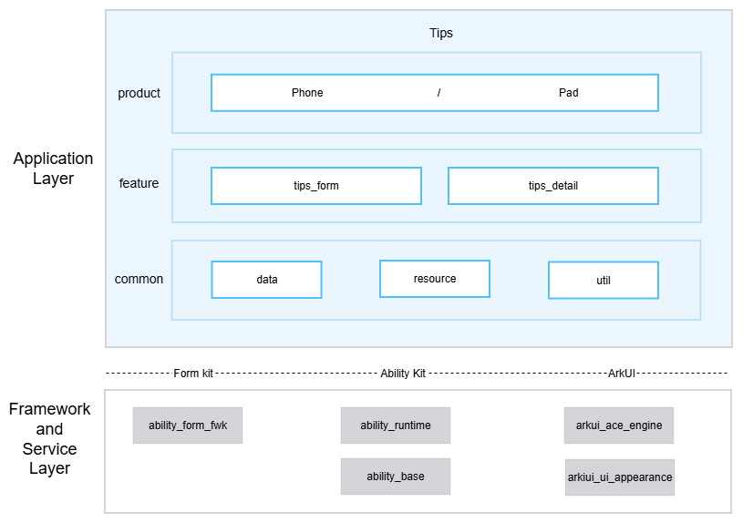

# Tips

## Introduction

**Tips** (bundle name: `com.ohos.tips`) is a preinstalled **system application** in OpenHarmony. It provides device usage tips to users through service widgets and detail pages, and adapts to phone and tablet form factors.

### Core Capabilities

**Detail page**
- Supports displaying tip title, body, and image on the detail page; the content area extends into the status bar for an immersive interaction experience.
- Supports responsive layout that adapts by device type and window breakpoint; phones use a top-bottom layout, and tablets use a left-right split in wide-screen scenarios.
- Supports following the system language to switch the detail page language.
- Supports cross-application navigation from other system applications to the detail page.

**Service widget**
- Supports card-style content browsing, provides a `2*2` widget that displays short tip text and a background image.
- Supports tapping the service widget to open the matching detail page and show the corresponding title, body, and image.
- Supports daily random refresh to display the tip of the day.
- Supports sequential refresh: after opening detail from the widget and exiting, the widget can switch to the next tip in the widget list order.
- Supports following the system language to switch the widget text language.
- Supports adding new tips: add a tip directory under `rawfile` and configure detail and widget resources; to show on the desktop widget, also write the ID into `tips_list.json`.

### Architecture Description

Tips uses a layered and modular design, organizing code by product form factor, business features, and common capabilities, as shown in the figure:

**Figure 1** Tips layered architecture



### Application-Layer Layered Design

The overall structure is divided into product, feature, and common layers:

| Layer | Main directories/components | Description |
| --- | --- | --- |
| Product | `product` | Supports phone and tablet form factors |
| Feature | `feature/tips_form`, `feature/tips_detail` | Service widget, detail page |
| Common | `common/util`, `common/resource`, `common/data` | util (window breakpoints, language, logging), resource (rawfile reading), data (cross-feature constants and entities) |

Dependency rules:

- The product layer may depend on the feature and common layers.
- The feature layer may depend only on the common layer.
- The common layer does not depend on the product or feature layers.
- `tips_form` and `tips_detail` do not depend on each other.

**Feature-layer modules**:

| Core capability | Module | Description |
| --- | --- | --- |
| Detail page | tips_detail | Immersive image-and-text display, responsive layout, language switching, cross-application open |
| Service widget | tips_form | Widget browsing and navigation, random/sequential refresh, language switching, tip extension |

**Common-layer modules**:

| Core capability | Module | Description |
| --- | --- | --- |
| Data model | data | Cross-feature constants and content entities |
| Resource reading | resource | rawfile reading and image transcoding |
| Common utilities | util | Window breakpoints, language switching, logging, and context |

### Relationship with Other Applications

| Item | Description |
| --- | --- |
| Whether other applications can call | Allowed. `EntryAbility` declares `exported` as `true`; other system applications can launch it with an explicit Want |
| Who can call | Only system applications can call; they can start it with an explicit Want; the desktop can launch it through the service-widget FormLink |
| When it can be called | Can be called after the application is preinstalled or installed; opening the detail page requires no extra runtime permission |
| Supported Want parameters | `bundleName` is `com.ohos.tips`, `abilityName` is `EntryAbility`; must carry `detailLink` in the `parameters.params` JSON string (the value matches the `rawfile` subdirectory name); optional `formId` |
| Cross-process services | No external RPC data service; cross-application support is limited to opening a specified detail page through Want |

## Build

This project is a multi-module HAP application built with Hvigor. The artifact is the `com.ohos.tips` system application package.

- The product-layer entry module (`product/phone`) is compiled into a deployable HAP.
- Feature HARs (`tips_form`, `tips_detail`) and the common HAR (`tips_common`) are compiled first, then packaged into the HAP through product-layer dependencies.

Ability and Form entries are declared in `product/phone/src/main/module.json5`:

```json
{
  "module": {
    "name": "entry",
    "type": "entry",
    "mainElement": "EntryAbility",
    "deviceTypes": [
      "default",
      "tablet"
    ],
    "abilities": [
      {
        "name": "EntryAbility",
        "srcEntry": "./ets/entryability/EntryAbility.ets",
        "exported": true
      }
    ],
    "extensionAbilities": [
      {
        "name": "EntryFormAbility",
        "srcEntry": "./ets/entryformability/EntryFormAbility.ets",
        "type": "form"
      }
    ]
  }
}
```

### Environment Requirements
- OpenHarmony SDK: compileSdkVersion 26, compatibleSdkVersion / targetSdkVersion 23
- DevEco Studio or the command-line Hvigor toolchain
- System signing certificates (see `signature/`)

From the project root:

```bash
# Open the project in DevEco Studio and run Build, or use the hvigor CLI
hvigorw assembleHap
```

After a successful build, the HAP is generated under `product/phone/build`.

## Tips Development

Tips is developed in ArkTS, and the UI is based on the ArkUI Stage model. The application hosts the main UI and cross-application navigation through `EntryAbility`, implements detail display through `feature/tips_detail`, implements service-widget orchestration and refresh through `feature/tips_form`, and provides common capabilities such as window, language, logging, and `rawfile` reading through `common`. For development reference, see: [ArkUI Development Overview](https://gitcode.com/openharmony/docs/blob/master/en/application-dev/ui/arkts-ui-development-overview.md)

### Development Based on Existing Modules

Applicable scenarios: customize existing capabilities, for example adjusting detail-page layout and text display, changing the widget refresh strategy, or adding tip content through `rawfile`.

Identify the change point: locate by business boundary to `product/phone` (entry and pages), `feature/tips_detail` (detail page), `feature/tips_form` (service widget), or `common` (common capabilities).

Common modification scenarios are listed below:

**Scenario 1: Modify the detail-page chain**
   - Page UI is at `feature/tips_detail/src/main/ets/default/view/DetailPage.ets`
   - Content conversion is at `feature/tips_detail/src/main/ets/default/convert/DetailPageConvert.ets`
   - Responsive layout is at `feature/tips_detail/src/main/ets/default/util/DetailResponsiveLayoutUtil.ets`

For example, to adjust the default detail ID or language-selection logic, extend `DetailPageConvert.idToModel()`:
```typescript
    // DetailPageConvert.ets
    static idToModel(pageId: string, context: common.Context): DetailPageModel {
      const model: DetailPageModel = new DetailPageModel();
      const resolvedId = pageId || DetailPageConstant.DEFAULT_PAGE_ID;
      const rawFilePath = `${resolvedId}/${DetailPageConstant.DETAIL_JSON}`;
      const entity = RawFileResourceUtil.readJsonSync<DetailPageEntity>(context, rawFilePath);
      // [Change point] Extend default ID, fallback, or language-selection logic here
      ...
      return model;
    }
```

**Scenario 2: Modify the service-widget chain**
   - Widget business is at `feature/tips_form/src/main/ets/default/presenter/FormPresenter.ets`
   - Content conversion is at `feature/tips_form/src/main/ets/default/convert/TipsConvert.ets`
   - Widget UI is at `feature/tips_form/src/main/ets/default/view/WidgetCard.ets`

For example, to adjust tap-navigation parameters, extend FormLink in `WidgetCardView`:
```typescript
    // WidgetCard.ets
    FormLink({
      action: this.actionType,
      abilityName: this.abilityName,
      params: {
        formId: this.formId,
        detailLink: this.detailLink,
      }
    }) {
      // Widget UI
    }
```

**Scenario 3: Modify the refresh chain**
   - Sequential refresh is in `FormPresenter.updateForm()` (switch to the next tip after entering detail from the widget)
   - Scheduled random refresh is in `FormPresenter.randomRefreshForm()` (triggered by `EntryFormAbility.onUpdateForm`)
   - The widget list comes from `rawfile/tips_list.json`

For example, to adjust next-index calculation for sequential refresh, modify `FormPresenter.updateForm()`:
```typescript
    // FormPresenter.ets 
    public updateForm(formId: string): void {
      ...
      let nextIndex = (this.currentIndex + 1) % this.tipsCount;
      // [Change point] Change to reverse order, skip specified IDs, or select tipId by custom rules
      let tipId = this.tipIds[nextIndex];
      let nextTip = this.loadTipEntity(tipId, ctx);
      ...
    }
```

**Scenario 4: Extend tip content**
   - Resource directory is at `product/phone/src/main/resources/rawfile/`
   - The detail page and service widget share the same tip ID directory
   - Configure detail content in `detail.json`, widget content in `tip.json`, and whether an ID joins the widget display list in `tips_list.json`
   - Note: when adding detail only, provide `detail.json` and images only; do not provide `tip.json` and do **not** write into `tips_list.json`; open via Want carrying `detailLink`. When adding a widget, supplement `tip.json` and the widget background on top of the detail resources, and write the ID into `tips_list.json`; the tip can be shown and open detail only after the user adds the desktop service widget

For example, when adding `tip_demo`, the directory and configuration are as follows:

```json
    product/phone/src/main/resources/rawfile/
    ├── tips_list.json              # Widget content-pool ID list
    └── tip_demo/
        ├── detail.json             # Detail content (required)
        ├── tip.json                # Widget content (configure when desktop widget is needed)
        ├── tip_demo.png            # Detail image (required)
        └── card_bg.jpg             # Widget background (configure when desktop widget is needed)
```

`detail.json` is the detail-page resource configuration file and must be provided
```json
    // tip_demo/detail.json 
    {
      "id": "tip_demo",
      "image": "tip_demo.png",
      "title": {
        "zh": "示例技巧标题",
        "en": "Sample tip title"
      },
      "content": {
        "zh": "这里是详情页中文正文。",
        "en": "Detail page body in English."
      }
    }
```
`tip.json` is the widget resource configuration file; omit it when adding detail only, and provide it when adding a widget
```json
    // tip_demo/tip.json
    {
      "tipBgImage": "card_bg.jpg",
      "tipDesc": {
        "zh": "示例卡片短文案",
        "en": "Sample card description"
      },
      "detailLink": "tip_demo"
    }
```
`tips_list.json` configures the widget list to display; do not write the ID when adding detail only, and append the ID when adding a widget
```json
    // tips_list.json — do not write for detail-only; must append the ID when adding a widget
    ["tip_openharmony", "tip_calendar", "tip_play_tips", "tip_demo"]
```
**Scenario 5: Modify UI components**
   - Detail-page UI is at `feature/tips_detail/src/main/ets/default/view/DetailPage.ets`
   - Widget UI is at `feature/tips_form/src/main/ets/default/view/WidgetCard.ets`
   - Detail responsive layout is at `feature/tips_detail/src/main/ets/default/util/DetailResponsiveLayoutUtil.ets`

For example, to adjust the widget title style, modify `widgetInfoBuilder()`:
```typescript
    // WidgetCard.ets 
    Text(this.widgetTitle)
      .fontSize($r('sys.float.ohos_id_text_size_headline9'))
      .fontWeight(FontWeight.Bold)
      .maxLines(1)
      .textOverflow({ overflow: TextOverflow.Ellipsis })
      .fontColor($r('sys.color.ohos_fa_text_primary_dark'))
      .layoutWeight(1)
```

Common modification entry points:

| Target | Path |
| --- | --- |
| Detail-page UI | `feature/tips_detail/src/main/ets/default/view/DetailPage.ets` |
| Detail conversion | `feature/tips_detail/src/main/ets/default/convert/DetailPageConvert.ets` |
| Responsive layout | `feature/tips_detail/src/main/ets/default/util/DetailResponsiveLayoutUtil.ets` |
| Widget business | `feature/tips_form/src/main/ets/default/presenter/FormPresenter.ets` |
| Widget conversion | `feature/tips_form/src/main/ets/default/convert/TipsConvert.ets` |
| Widget UI | `feature/tips_form/src/main/ets/default/view/WidgetCard.ets` |
| Home routing | `product/phone/src/main/ets/pages/Index.ets` |
| Widget Form | `product/phone/src/main/ets/widget/pages/WidgetCard.ets` |
| Tip content resources | `product/phone/src/main/resources/rawfile/` |

### Developing New Feature Capabilities

Applicable scenarios: add detail or widget related capabilities, extend widget sizes and refresh strategies, supplement differentiated interactions, or adapt to new device form factors.

> **Note:**
> This project uses a `product + feature + common` multi-module structure. The product entry is mainly under `product/phone`. New capabilities are generally extended along the existing layering; if a new product-form HAP is added, create the corresponding directory under `product/` and register it in `build-profile.json5`.

**Step 1: Extend business capabilities**

1. In `feature/tips_detail`, supplement detail-page UI, conversion, or responsive layout logic.
2. In `feature/tips_form`, supplement widget orchestration, conversion, or `WidgetCardView` display logic.
3. If common capabilities are involved, extend constants, `rawfile` reading, or window/language utilities in `common`, and reference them from the feature layer.
4. If the product entry is involved, extend `EntryAbility`, `EntryFormAbility`, `pages/`, or `widget/pages/` under `product/phone` accordingly.
5. If only tip content is extended, add a directory under `rawfile` as described in the previous section "Extend tip content", and update `tips_list.json` as needed.

**Step 2: Configure/confirm Ability entries**

Project entries are already declared in `product/phone/src/main/module.json5`. When extending capabilities, usually only confirm that Ability, Form, and `exported` settings meet the new scenario:

```json
{
  "module": {
    "name": "entry",
    "type": "entry",
    "mainElement": "EntryAbility",
    "deviceTypes": [
      "default",
      "tablet"
    ],
    "abilities": [
      {
        "name": "EntryAbility",
        "srcEntry": "./ets/entryability/EntryAbility.ets",
        "exported": true
      }
    ],
    "extensionAbilities": [
      {
        "name": "EntryFormAbility",
        "srcEntry": "./ets/entryformability/EntryFormAbility.ets",
        "type": "form"
      }
    ]
  }
}
```

**Step 3: Customize UI**

After business capabilities and Ability configuration are done, extend using the detail page, service widget, or product-entry modification approaches in the previous section "Modify and tailor existing modules".

If a standalone page is needed:

1. Add a page or `@Builder` entry file in the corresponding module;
2. If system route registration is required, declare it in `resources/base/profile/router_map.json`, and provide the Builder from product-layer `pages/`;
3. Launch it through `Navigation` in `Index`, `pushPathByName`, or Want routing.

If the service widget needs to be extended:

1. Extend widget UI and `FormPresenter` refresh logic in `feature/tips_form`;
2. Keep the Form entry under `product/phone` `widget/pages/`, and update size or refresh settings in `form_config.json` accordingly;
3. After adding the widget from the desktop service-widget entry, verify display and tap navigation.

## Directory

```text
openharmonytips
├─AppScope                                      # App-level config and locale resources
│  ├─app.json5                                  # bundleName, version, etc.
│  └─resources/                                 # Global strings / icons and other resources
├─common                                        # Common capabilities layer
│  └─src/main/ets/default/
│     ├─data/                                  # Common data, including detail-page constants, content entities, etc.
│     ├─resource/                               # rawfile resource reading, including JSON resource reading and image transcoding, etc.
│     └─util/                                   # Common utilities, including window breakpoints, language switching, logging, and context, etc.
├─feature                                       # Feature layer
│  ├─tips_form/                                 # Service-widget feature
│  │  └─src/main/ets/default/
│  │     ├─convert/                             # Widget content conversion, including JSON parsing and model conversion, etc.
│  │     ├─entity/                              # Widget entities, including short tip text and background data, etc.
│  │     ├─model/                               # Widget models, including tip data, widget parameters, jump parameters, and other data entities
│  │     ├─presenter/                           # Widget business logic, including add/refresh and random/sequential switching, etc.
│  │     └─view/                                # Widget UI
│  └─tips_detail/                               # Detail-page feature
│     └─src/main/ets/default/
│        ├─common/                              # Detail-page utilities, including environment properties, etc.
│        ├─convert/                             # Detail content conversion, including detail data parsing and model conversion, etc.
│        ├─entity/                              # Detail entities, including title, body, and image data, etc.
│        ├─model/                               # Detail models, including title, body, and image display data, etc.
│        ├─util/                                # Responsive layout, including phone top-bottom layout and tablet left-right split, etc.
│        └─view/                                # Detail-page UI, including immersive image-and-text display, etc.
├─product                                       # Product layer
│  └─phone/                                     # Phone / tablet form-factor HAP
│     └─src/main/
│        ├─ets/
│        │  ├─entryability/                     # Application main entry
│        │  ├─entryformability/                 # Service-widget lifecycle management
│        │  ├─pages/                            # Page entries
│        │  └─widget/pages/                     # Widget component entries
│        ├─resources/
│        │  ├─base/profile/                     # Configuration files
│        │  └─rawfile/                          # Tip resources
│        └─module.json5                         # Ability and Form declarations
├─hvigor                                        # Build tool config
├─signature                                     # Signing certificates and profile
├─build-profile.json5                           # Project-level config
├─oh-package.json5
├─OAT.xml                                       # Open-source compliance audit
├─LICENSE
├─README.md                                     # English documentation
└─README-zh.md                                  # Chinese documentation
```

## Constraints

- **Language version**: ArkTS
- **Runtime form**: Preinstalled system application (`com.ohos.tips`)
- **Device types**: Phone, tablet
- **Service widget size**: Only `2*2` is supported
- **Cross-application jump**: Only system applications can perform cross-application jumps; keep `EntryAbility` `exported` as `true`; Want must carry `detailLink` in the `parameters.params` JSON string (the value matches the `rawfile` subdirectory name)
- **Form-factor adaptation**: Phones default to a top-bottom layout; tablets use a left-right split in wide-screen scenarios (horizontal breakpoint greater than or equal to `840vp`); when modifying UI, verify both phone and tablet

## References

You are welcome to contribute code and documentation. For the contribution process, see [How to contribute](https://gitcode.com/openharmony/docs/blob/master/en/contribute/contribution-process.md).